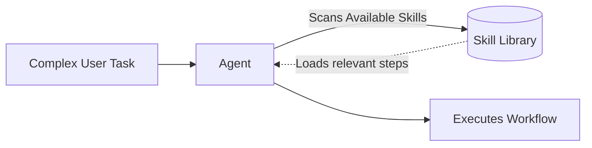

# Agentic Skills and Reusable Capabilities

I’ve been thinking more about what “skills” actually are in modern agent systems, especially after seeing how they’re implemented across platforms like Anthropic’s Claude and tools inspired by it such as OpenAI’s Codex ecosystem.

At a high level, skills are a shift away from treating prompts as one-off instructions. Instead, they package repeatable workflows into reusable units that an agent can load dynamically when needed.

---

## What are Skills?

Anthropic formally introduced Agent Skills as a way to extend agents with structured, reusable capabilities in their [Skills Announcement](https://www.anthropic.com/news/skills).

> [!abstract] Anatomy of a Skill
> A skill is not just a prompt. It is typically a folder that contains:
> 1. A `SKILL.md` file with instructions and metadata
> 2. Optional scripts or tools
> 3. Supporting resources or references

When an agent is working on a task, it scans available skills and loads only the relevant ones. This is often described as *“progressive disclosure,”* where the system avoids overloading context and instead pulls in knowledge just in time.

This design turns a general-purpose model into a specialist without retraining. Instead of memorizing workflows, the agent learns how to invoke them.

---

## Skills as a Portable Abstraction

One of the more interesting developments is that skills are no longer tied to a single platform. Anthropic published the Agent Skills format as an open standard, which has since been adopted across tools and ecosystems.

In practice, this means you can:
- Define a workflow once.
- Store it as a skill.
- Reuse it across different agents and environments.

This is a subtle but important shift. Skills are becoming an interoperability layer for agent behavior, similar to how APIs standardized service communication.

---

## The Skills Marketplace

To make this ecosystem usable, skills need to be discoverable.

Anthropic supports a skills marketplace through its Claude Code environment, where users can install and share skills as plugins. There are also broader community-driven marketplaces like [SkillsMP](https://smartscope.blog/en/blog/skillsmp-marketplace-guide/).

These marketplaces are early, but the direction is clear:
* Skills become composable building blocks.
* Teams share and reuse institutional knowledge.
* Discovery becomes as important as creation.

> [!quote] A Node in the Garden
> As I noted in [[Why I'm creating a digital garden]], creating an interconnected, composable "second brain" is key to preserving knowledge. A Skills Marketplace operates on the exact same philosophical principle: building structured repositories of knowledge that evolve and interlink organically.

---

## Concrete Examples: PR Review Skills

To make this less abstract, consider how skills are being used in real workflows. The [PR Review Toolkit](https://claude.com/plugins/pr-review-toolkit) is a good example.

Instead of manually reviewing pull requests or writing ad hoc prompts, this toolkit bundles multiple agents into a reusable system:

| Capability | What it checks |
| :--- | :--- |
| **Accuracy Analysis** | Compares code against inline comments. |
| **Coverage Detection** | Identifies gaps in test coverage. |
| **Failure Prediction** | Detects silent failures and bugs. |
| **Design Evaluation** | Evaluates type design and structures. |
| **Simplification** | Suggests ways to simplify the code. |

Teams expose granular commands on top of these systems, such as `/pr-comments` or `/pr-toolkit-pr-review`. Rather than vaguely asking an agent to “review code,” you invoke a specific capability.

---

## Toward Self-Improving Systems

Some newer tooling focuses not just on creating skills, but improving them, such as Anthropic’s [Skill Creator workflows](https://claude.com/plugins/skill-creator).

> [!tip] Evolving Systems
> This suggests a future where skills are continuously evaluated, performance is tracked, and improvements are driven by real usage data.
> 
> Skills are beginning to behave more like evolving ecosystems than static artifacts.

### A Practical Extension: Agentic ML Plugins

Recently, I started using the [Agentic ML Plugin](https://github.com/lawwu/agentic-ml-plugin) by Lawrence Wu, my manager at UKG. 

What’s interesting about this approach is that it treats workflows as composable, agent-driven pipelines. Instead of writing isolated scripts, you define capabilities that can be invoked, combined, and extended. This connects back to the idea of [[Changing Landscape of SDLC|skill chaining]].

If each stage of development or analysis is encapsulated as a skill, then systems like this plugin become orchestration layers. You are no longer just writing code or prompts; you are designing systems of reusable intelligence.

And that is the real shift.